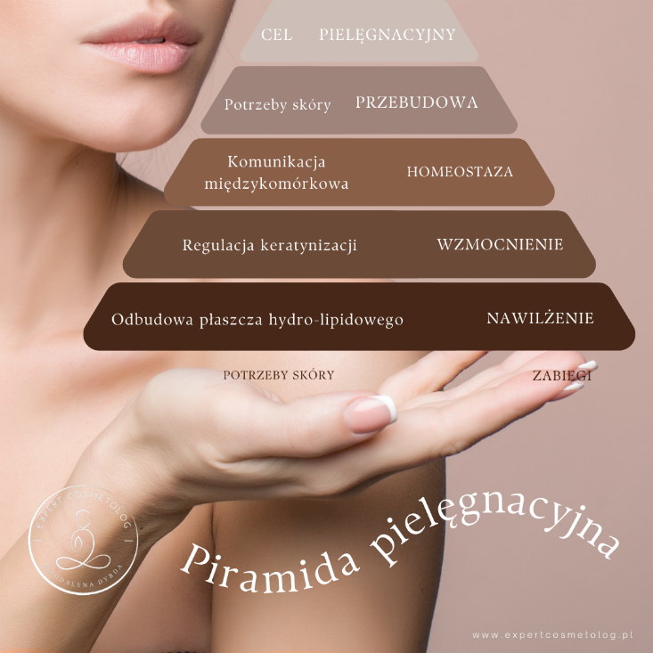


Mgr Magdalena Dyrda


Peptydy, komórki macierzyste i egzosomy to trzy składniki aktywne, które mogą być stosowane w kosmetologii holistycznej. Integracja tych składników w procesie pielęgnacyjnym przynosi wiele wymiernych korzyści dla skóry, gdzie nadrzędnym jest jej piękny, młody, promienny wygląd. Zintegrowanie w pielęgnacji skóry składników aktywnych o działaniu epigenetycznym niesie ze sobą wiele korzyści w funkcjonowaniu i wyglądzie skóry. Oprócz zastosowania odpowiednich składników aktywnych, należy położyć nacisk na pielęgnację skóry w nurcie holizmu i uwzględnić potrzeby skóry na różnych poziomach. Ważne jest również, aby wprowadzić do pielęgnacji elementy uważności i autorelaksacji.

Kosmetologia holistyczna to podejście do pielęgnacji skóry, które uwzględnia jej potrzeby na różnych poziomach. Holistyczne podejście do pielęgnacji skóry zakłada, że stan skóry jest odzwierciedleniem jej ogólnego stanu metabolicznego, biochemicznego oraz emocjonalnego. Dlatego też, aby uzyskać najlepsze efekty w programowaniu personalizowanej pielęgnacji, należy uwzględnić zarówno potrzeby fizjologiczne, jak i emocjonalne skóry, do których możemy zaliczyć wpływ czynników epigenetycznych.

Hierarchia w Piramidzie Potrzeb Skóry, którą opracowałam w mojej wieloletniej praktyce zawodowej, to model, który pomaga zrozumieć, w jaki sposób różne potrzeby skóry powinny być zaspokajane, w celu uzyskania najlepszych efektów w postępowaniu holistycznej pielęgnacji. Model ten przedstawia potrzeby skóry w formie piramidy, w której każda z warstw reprezentuje inny poziom potrzeb. Na każdym etapie w Piramidzie Potrzeb Skóry wdrażamy elementy uważności, autorelaksacji. 

Najniższy poziom piramidy to **nawilżenie z odbudową płaszcza wodno-tłuszczowego**. Jest to podstawowa potrzeba skóry, bez której nie może ona prawidłowo funkcjonować. Nawilżenie zapewnia skórze odpowiedni poziom wody, co jest niezbędne do jej jędrności i elastyczności. W skórze odpowiednio nawodnionej i nawilżonej reakcje biochemiczne przebiegają sprawniej, stan błon komórkowych jest w lepszej kondycji, co usprawnia szlaki komunikacji międzykomórkowej. Odbudowa płaszcza wodno-tłuszczowego to fundamentalny i konieczny etap, ponieważ przywraca atawistyczną funkcję skóry – ochronę przed szkodliwym działaniem czynników zewnętrznych. Uważność wspomaga świadome wykonywanie czynności pielęgnacyjnych, a także w skupieniu się na odczuciach pielęgnacyjnych. Autorelaksacja na tym etapie zmniejsza stres i napięcia, które mogą negatywnie wpływać na stan skóry.

Następny poziom piramidy to **wzmocnienie**. Obejmuje ono regulację TOT (ang. Turn over time) w procesie keratynizacji, czyli procesów odpowiedzialnych za tworzenie nowych komórek skóry oraz ich przejścia z warstwy podstawnej do warstwy rogowej w naskórku. Odnawianie się naskórka pozwala na utrzymanie integralności międzykomórkowej, co wpływa na zmniejszenie transepidermalnej utraty wody, jakości cementu międzykomórkowego i prowadzi ogólnie do dobrej kondycji skóry i lepszej spójności jej poszczególnych warstw. 

Na tym etapie dużą rolę pełnią czynniki epigenetyczne. Są to czynniki, które wpływają na ekspresję genów bez zmiany ich sekwencji. Mogą one być zarówno wewnętrzne, jak i zewnętrzne. W pielęgnacji skóry można wykorzystywać czynniki epigenetyczne w celu:
 - Opóźnienia procesu starzenia się skóry: stosowanie kosmetyków zawierających składniki aktywne o działaniu epigenetycznym, takie jak peptydy, komórki macierzyste czy egzosomy. 
 - Zmniejszenia ryzyka rozwoju chorób skórnych: stosowanie kosmetyków zawierających składniki aktywne o działaniu przeciwzapalnym czy antyoksydacyjnym wspomaga procesy obronne na poziomie komórkowym.
 - Poprawy skuteczności zabiegów pielęgnacyjnych, poprzez „nauczanie” komórek szlaków metabolicznych właściwych np. przy skórach problematycznych tj. skóry nadwrażliwe, trądzikowe, z przebarwieniami czy zaburzeniami autoimmunologicznymi.

Na etapie wzmocnienia uważność wspomaga dokładny dobór kosmetyków oraz procedur zabiegowych i wykluczeniu tych, które nam nie służą. Autorelaksacja zastosowana w rytualności pielęgnacyjnej - w poprawie krążenia krwi i limfy, co może przyczynić się do szybszej regeneracji skóry.

Poziom trzeci piramidy to **homestaza**. Obejmuje ona wyciszenie układu immunologicznego skóry (ang. SIS -Skin immune system). Homestaza pozwala na utrzymanie równowagi fizjologicznej komórek skóry, tj. keratynocytów, fibroblastów, melanocytów, komórek Langerhansa, komórek tucznych - co zapobiega nadprogowej reaktywności skóry. W praktyce kosmetologicznej zauważalnie zmniejsza się zaczerwienie skóry. Uzyskanie homeostazy skóry, przekłada się na lepszą przyswajalność składników aktywnych z kosmetyków. W konsekwencji skóra ulega rzadszym podrażnieniom i staje się mniej „histerycza” – mniej nadreaktywna. To pozwala rozpocząć stymulowanie skóry do przebudowy. Na tym etapie praca holistyczna z uważnością wspomaga rozpoznawanie objawów zmiennej aktywności układu immunologicznego skóry i podejmowanie odpowiednich działań mających na celu przybliżenie do założonego celu pielęgnacyjnego, a autorelaksacja w wyciszeniu układu odpornościowego.

Czwarty poziom piramidy to **przebudowa**. Obejmuje ona wzmocnienie potrzeb i deficytów komórkowych oraz uzyskanie założonych efektów terapeutycznych. Przebudowa skóry pozwala na uzyskanie widocznych rezultatów pielęgnacji, takich jak redukcja zmarszczek, poprawa napięcia, elastyczności skóry, zapoczątkowanie procesów neoangiogenezy czy rozjaśnienie przebarwień. Na etapie przebudowy uważność może pomóc nam w cierpliwym i świadomym oczekiwaniu na efekty pielęgnacji, a autorelaksacja w utrzymaniu pozytywnego nastawienia.

Najwyższy poziom piramidy to **cel pielęgnacyjny**. Nastawiony jest na ustabilizowanie przebudowanego metabolizmu skórnego. Cel pielęgnacyjny to ostateczny efekt, jaki chcemy osiągnąć poprzez spersonalizowany plan holistycznej pielęgnacji skóry. Na tym etapie bardzo ważne jest umacnianie mechanizmów ochronnych skóry oraz utrzymanie jej w pełnej homeostazie. Na etapie celu pielęgnacyjnego uważność pomaga dostrzec wymarzony efekt pielęgnacji, a autorelaksacja umacnia nas w motywacji do dalszej systematycznej pielęgnacji.

Hierarchia potrzeb skóry jest ważna w skutecznej pielęgnacji, ponieważ pozwala na dopasowanie zabiegów i kosmetyków do indywidualnych potrzeb skóry. Jeśli zaczniemy od zaspokojenia podstawowych potrzeb skóry, takich jak nawilżenie i wzmocnienie, to będziemy mogli przejść do bardziej zaawansowanych zabiegów i praktyk pielęgnacyjnych, które pozwolą nam osiągnąć zamierzony cel pielęgnacyjny.

Spersonalizowana pielęgnacja skóry to podejście, które pozwala osiągnąć najlepsze efekty pielęgnacyjne. Dzięki dokładnej ocenie stanu skóry i opracowaniu indywidualnego planu pielęgnacji można dobrać odpowiednie kosmetyki, zabiegi oraz techniki relaksacyjne, które będą skutecznie odpowiadać na potrzeby i problemy skóry. Czynniki, które pozwalają dobrze zaprojektować spersonalizowaną pielęgnację skóry, to:
 - Ocena stanu skóry: w pierwszej kolejności należy przeprowadzić dokładną ocenę stanu skóry, aby określić jej potrzeby i problemy. Do tego celu można wykorzystać różne metody, takie jak wywiad z klientem, analiza składu skóry, testy diagnostyczne czy ocena wizualna w obrazowaniu rzeczywistym.
 - Opracowanie indywidualnego planu pielęgnacji: na podstawie wyników oceny stanu skóry należy opracować indywidualny plan pielęgnacji, który będzie dostosowany do potrzeb i problemów klienta. Plan powinien zawierać informacje o rodzajach kosmetyków, które zastosować, ich częstotliwości nakładania i ilości, a także o dodatkowych profesjonalnych zabiegach pielęgnacyjnych, które mogą być niezbędne.
 - Edukacja klienta: bardzo ważne jest, aby klient był świadomy stanu swojej skóry i wiedział, jak prawidłowo ją pielęgnować, zarówno w sferze Psyche jak i Physis. Dlatego należy go odpowiednio przeszkolić w zakresie stosowania kosmetyków i wykonywania domowych zabiegów pielęgnacyjnych.

Najnowsze trendy kosmetologii profesjonalnej oferują rozwiązania w formulacjach kosmetyków działających na poziomie między- i śródkomórkowym. W trendzie kosmetologii holistycznej, globalne działanie na skórę na poziomie naskórkowym oraz skóry właściwej prym wiodą trzy grupy składników aktywnych: komórki macierzyste, peptydy oraz egzosomy.

Wszystkie trzy grupy składników aktywnych wykazują działanie epigenetyczne. Mają one różną budowę, różne właściwości oraz mechanizmy działania. Porównanie tych trzech rodzajów składników aktywnych przedstawia poniższa tabela:

|Cecha|Komórki macierzyste|Peptydy|Egzosomy|
|--|--|--|--|
|**Definicja**|Komórka macierzysta to niespecjalizowana komórka, która ma zdolność do samoodnawiania i różnicowania się w komórki potomne o określonym przeznaczeniu.|Peptyd to krótki łańcuch aminokwasów, który może mieć różne właściwości biologiczne, takie jak działanie przeciwutleniające, przeciwstarzeniowe, przeciwzapalne i przeciwdrobnoustrojowe.|Egzosomy to bezkomórkowe pęcherzyki, które są wydzielane przez komórki.|
|**Pochodzenie w kosmetyce**|Ludzkie, zwierzęce, roślinne|	Zwierzęce, roślinne, biotechnologiczne|Roślinne|
|**Właściwości**|Mają zdolność do przekształcania się w różne typy komórek skóry.|Mają właściwości, takie jak działanie przeciwutleniające, przeciwstarzeniowe, przeciwzapalne i przeciwdrobnoustrojowe, sygnalizacyjne.|Zawierają białka i informacje genetyczne, które mogą być wykorzystywane do przekazywania sygnałów między komórkami|
|**Mechanizm działania**|Komórki macierzyste mają zdolność do różnicowania się w komórki różnych typów tkanek.|	Peptydy działają aktywizująco lub inhibująco w wielu ważnych funkcjach sygnałowych skóry, mogą wpływać na ekspresję genów.|	Egzosomy mogą działać poprzez przekazywanie sygnałów między komórkami. Zawierają białka i informacje genetyczne, które mogą wpływać na ekspresję genów i aktywność komórek.|
|**Zastosowanie w kosmetologii**|Komórki macierzyste mogą być wykorzystywane do regeneracji skóry, na przykład po oparzeniu słonecznym lub zabiegach medycyny estetycznej. Pobudzenia metabolizmu międzykomórkowego. Kompatybilne z peptydami, wyciągami roślinnymi, witaminami.|Peptydy mogą być wykorzystywane do stymulacji produkcji kolagenu i elastyny, zmniejszania widoczności zmarszczek i bruzd oraz ochrony przed uszkodzeniami egzogennymi. Dobrze działają z witaminami ACE, retinolem, komórkami macierzystymi, egzosomami.|Zastosowania obejmują leczenie oparzeń, aktywnego trądziku, atopowego zapalenia skóry i przewlekłych podrażnień skóry. W połączeniu z leczeniem urządzeniami opartymi na energii, egzosomy zmniejszają stan zapalny i zaczerwienienie, poprawiają szybkość gojenia u pacjentów poddawanych zabiegom laserowym i mikroigłowym oraz zmniejszają tendencję do zwłóknienia i powstawania grubych blizn przerostowych, gdy są stosowane miejscowo. Pobudzają porost włosów.|

Zintegrowanie w pielęgnacji skóry składników aktywnych o działaniu epigenetycznym niesie ze sobą wiele korzyści, które owocują w:
 - Poprawę nawilżenia skóry - stymulowanie produkcji naturalnych składników nawilżających skóry, takich jak kwas hialuronowy, daje poprawę nawilżenia w głębszych warstwach skóry.
 - Poprawę struktury skóry - stymulacja produkcji kolagenu i elastyny, co prowadzi do poprawy jędrności, elastyczności i napięcia skóry.
 - Poprawę funkcji ochronnych skóry - wspomaganie mechanizmów antyoksydacyjnych oraz immunomodulujących. 
 - Poprawy wyglądu skóry – utrzymacie homeostazy oraz wpływ na procesy regeneracyjne (ziarninowanie, neoangiogeneza).

Podsumowując - komórki macierzyste, peptydy i egzosomy to trzy składniki aktywne, które mogą być stosowane w kosmetologii holistycznej w celu stworzenia optymalnego planu pielęgnacyjnego zabezpieczającego wszystkie poziomy pielęgnacji w Piramidzie Potrzeb Skóry. Integracja tych składników w procesie pielęgnacyjnym przynosi wiele wymiernych korzyści dla skóry, gdzie nadrzędnym jest jej piękny, młody, promienny wygląd.

Oprócz zastosowania odpowiednich składników aktywnych, należy położyć nacisk na pielęgnację skóry w nurcie holizmu i uwzględnić potrzeby skóry na różnych poziomach. Ważne jest również, aby wprowadzić do pielęgnacji elementy uważności i autorelaksacji, które mogą pozytywnie wpłynąć na stan skóry, nadając rytualność w podejściu do uzyskanych rezultatów oraz wzmacniając motywację pielęgnacyjną.

**Literatura:**
1.	RATAJCZAK, Mariusz Z. Komórki macierzyste i ich potencjalne wykorzystanie w klinice. Rocznik Teologii Katolickiej, 2012, 11: 95-107.
2.	LIPIŃSKI, W.; KOLESIŃSKA, B. Modulowanie właściwości peptydów penetrujących do komórek. Wiadomości Chemiczne, 2017, 71.9-10: 695-726.
3.	KRZYWIK, Julia; KATARZYŃSKA, Joanna. Renesans peptydów a nowe cele terapeutyczne. Eliksir, 2015.
4.	NGOC, Le Thi Nhu; MOON, Ju-Young; LEE, Young-Chul. Insights into Bioactive Peptides in Cosmetics. Cosmetics, 2023, 10.4: 111.
5.	PAI, Varadraj Vasant; BHANDARI, Prasana; SHUKLA, Pankaj. Topical peptides as cosmeceuticals. Indian Journal of Dermatology, Venereology and Leprology, 2017, 83: 9.
6.	SKIBSKA, Agnieszka; PERLIKOWSKA, Renata. Signal peptides-promising ingredients in cosmetics. Current Protein and Peptide Science, 2021, 22.10: 716-728.
7.	LAW, Peter K., et al. Genetic Cell Therapy in Anti-Aging Regenerative Cosmetology. In: Handbook of Stem Cell Applications. Singapore: Springer Nature Singapore, 2023. p. 1-23.
8.	SHEN, Xu, et al. Stem cell‐derived exosomes: A supernova in cosmetic dermatology. Journal of Cosmetic Dermatology, 2021, 20.12: 3812-3817.
9.	THAKUR, Abhimanyu, et al. Therapeutic Values of Exosomes in Cosmetics, Skin Care, Tissue Regeneration, and Dermatological Diseases. Cosmetics, 2023, 10.2: 65.
10.	CHO, Byong Seung; DUNCAN, Diane Irvine. Development of Exosomes for Esthetic Use. 2023.
11.	LINTNER, Karl. Peptides and proteins. Cosmetic Dermatology: Products and Procedures, 2022, 388-400.
12.	AKBARIAN, Mohsen, et al. Bioactive peptides: Synthesis, sources, applications, and proposed mechanisms of action. International journal of molecular sciences, 2022, 23.3: 1445.
13.	MAZURKIEWICZ-PISAREK, Anna; BARAN, Joanna; CIACH, Tomasz. Antimicrobial Peptides: Challenging Journey to the Pharmaceutical, Biomedical, and Cosmeceutical Use. International Journal of Molecular Sciences, 2023, 24.10: 9031.
14.	SHARMA, Madhu, et al. REGIMEN IN COSMETOLOGY. 2023.
15.	VOROUS, Mary; DENITTO, Debbie. More Than Beauty: Meeting Patients' Aesthetic Needs. Oncology Issues, 2021, 36.1: 66-66.
16.	GOLDIE, Kate, et al. Skin quality–a holistic 360 view: consensus results. Clinical, cosmetic and investigational dermatology, 2021, 643-654.
