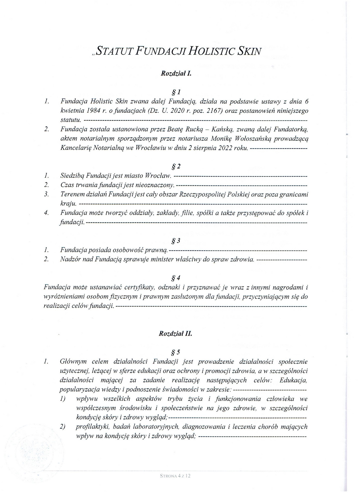
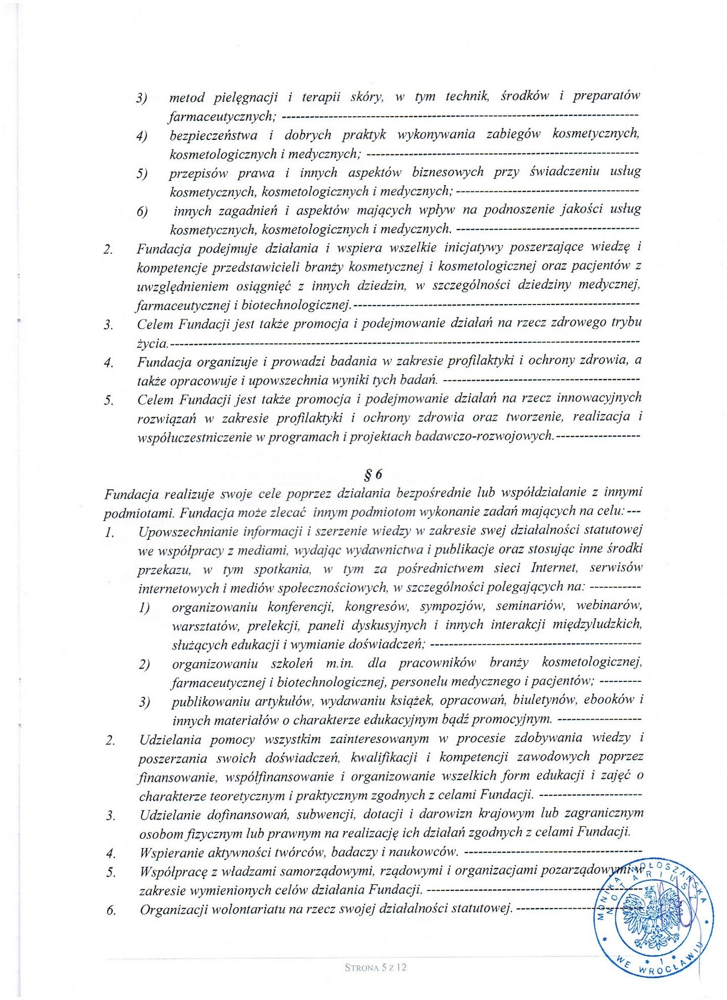
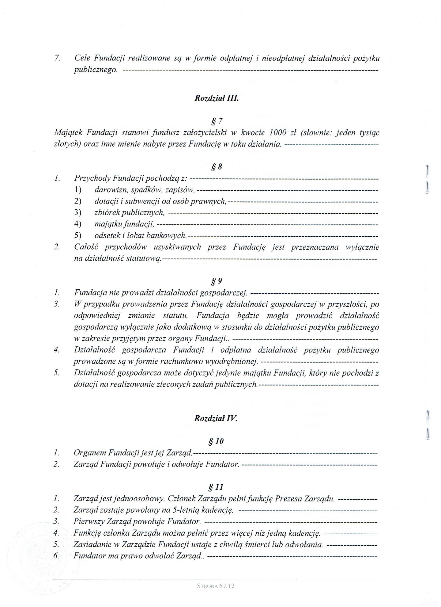
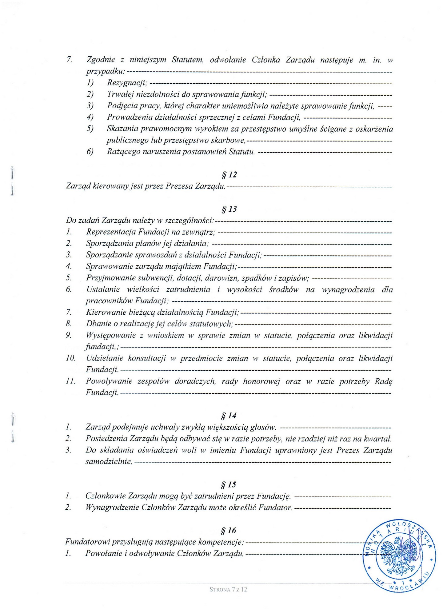
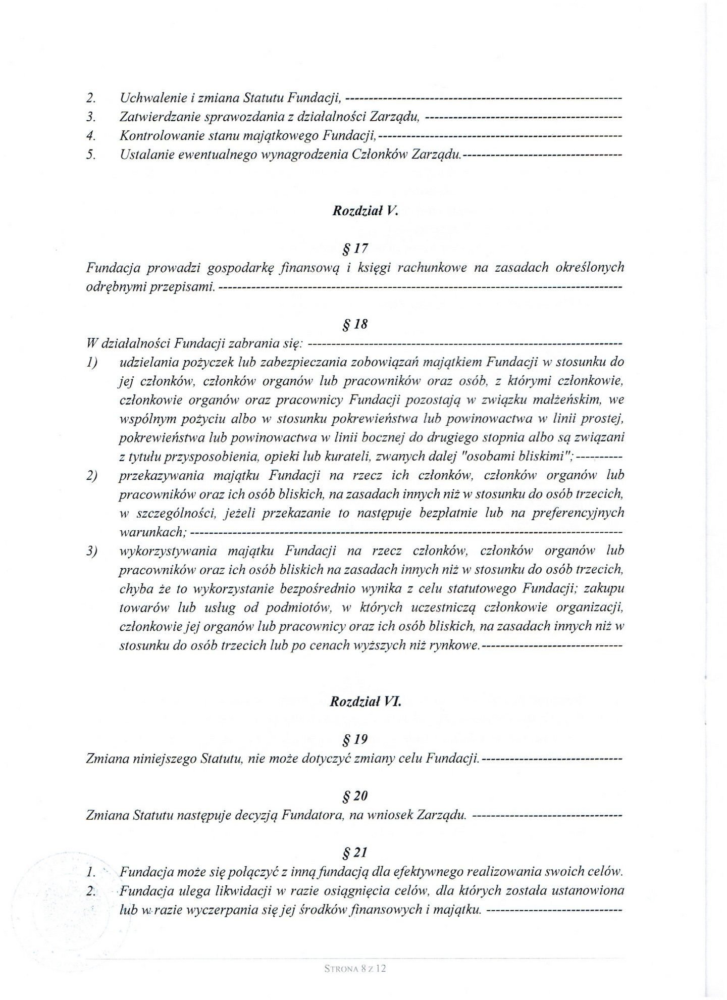
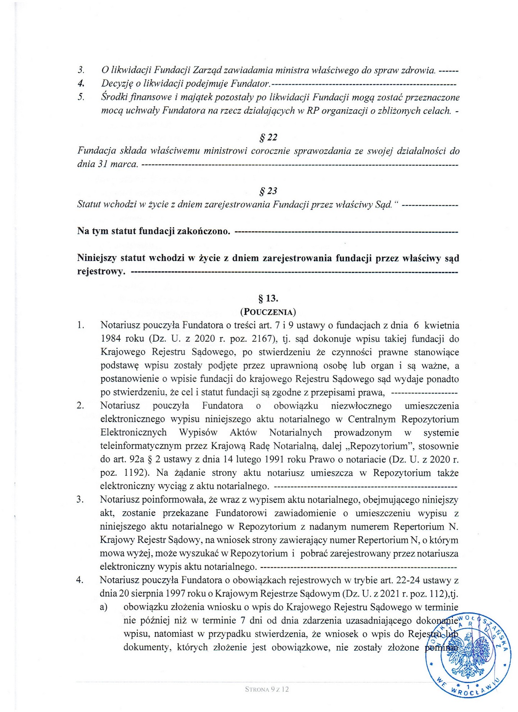

## Dane identyfikacyjne


 - **Nazwa**: Fundacja Holistic Skin



 - **KRS**: 0000994021



 - **NIP**: 894-319-56-36



 - **REGON**: 523219541-00000


## Adres siedziby

 - ul. Osmańczyka 1/1A, 54-061 Wrocław


## Rachunek bankowy


 - **NRB**: 57 1140 2004 0000 3902 8297 7287


## Władze Fundacji


 - **Fundator**: Beata Rucka-Kańska



 - **Prezes Zarządu**: Grzegorz Kański


## Statut

<section class="w-full grid gap-4 sm:grid-cols-2 md:grid-cols-3 xl:grid-cols-4" style="min-height:530px">
    
    
    
    
    
    
</section>


